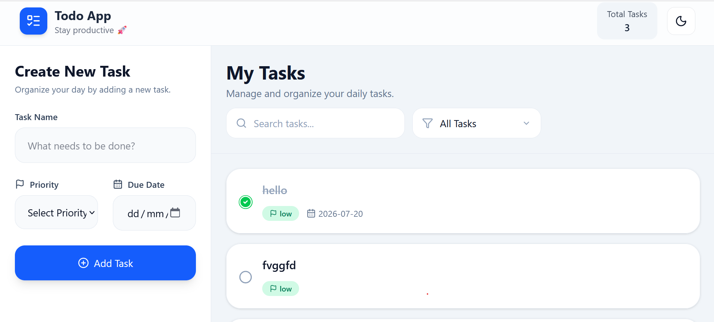
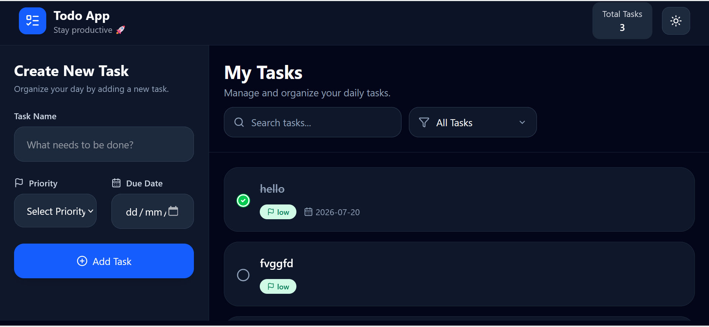

# 📝 Redux Todo Dashboard

A modern and responsive **Todo Dashboard** built with **React**, **Redux Toolkit**, and **Tailwind CSS**. The application allows users to efficiently manage their daily tasks with features like adding, editing, deleting, searching, filtering, theme switching, and local storage persistence.

---

## 🚀 Live Demo

> Add your deployed Vercel link here

**Live:** https://todo-app-redux-dusky.vercel.app/

---

## 📸 Preview

> Add screenshots or GIFs here

| Light Mode | Dark Mode |
|------|----------|
|  |  |

---

# ✨ Features

- ✅ Add new tasks
- ✏️ Edit existing tasks
- 🗑️ Delete tasks
- ✔️ Mark tasks as Completed/Pending
- 🔍 Search tasks
- 🎯 Filter tasks
- 🌙 Light/Dark Theme
- 💾 Local Storage Persistence
- 🔔 Toast Notifications
- 📱 Fully Responsive UI
- ⚡ Built with Redux Toolkit

---

# 🛠️ Tech Stack

### Frontend

- React 19
- Redux Toolkit
- React Redux
- React Hook Form
- Tailwind CSS
- Lucide React Icons
- React Toastify

---

# 📂 Project Structure

```
src
│
├── redux
│   ├── store.js
│   └── localStorage.js
│
├── components
│   ├── Navbar.jsx
│   ├── Sidebar.jsx
│   ├── TodoForm.jsx
│   ├── TodoList.jsx
│   ├── TodoItem.jsx
│   ├── SearchBar.jsx
│   └── Filter.jsx
│
├── features
│   ├── theme
│   │   └── themeSlice.js
│   │
│   └── todo
│       └── todoSlice.js
│
├── App.jsx
├── main.jsx
└── index.css
```

---

# ⚙️ Installation

Clone the repository

```bash
git clone git remote add origin git@github.com:chanchal430/todo-app-redux.git
```

Move inside the project

```bash
cd todo-app-redux
```

Install dependencies

```bash
npm install
```

Start development server

```bash
npm run dev
```

---

# 🎯 Functionality

## Add Todo

- Create a new task
- Select task priority
- Add due date
- Form validation using React Hook Form

---

## Edit Todo

- Update existing task
- Pre-filled form while editing

---

## Delete Todo

- Remove any task instantly
- Toast notification after deletion

---

## Complete Todo

- Toggle between Completed and Pending
- Visual completion status
- Success toast notifications

---

## Search

- Search tasks by title

---

## Filter

Filter tasks by:

- All Tasks
- Completed
- Pending
- High Priority
- Medium Priority
- Low Priority

---

## Theme

- Light Mode
- Dark Mode

Theme preference is stored in Local Storage.

---

## Local Storage

The application automatically persists:

- Todos
- Theme

using Redux Store subscriptions and `preloadedState`.

---

# 🧠 Redux Flow

```
User Action
      │
      ▼
Dispatch Action
      │
      ▼
Redux Slice
      │
      ▼
Redux Store
      │
      ▼
UI Updates
      │
      ▼
Local Storage
```

---

# 📦 Redux Slices

## Todo Slice

- addTodo
- deleteTodo
- editTodo
- completeTodo

---

## Theme Slice

- toggleTheme

---

# 🎨 UI Highlights

- Modern Dashboard Layout
- Responsive Sidebar
- Sticky Navbar
- Beautiful Cards
- Hover Effects
- Rounded UI Components
- Dashboard Style Design
- Mobile Friendly
- Dark Mode Support

---

# 📚 Concepts Practiced

- React Functional Components
- Component Composition
- Props
- State Management
- Redux Toolkit
- React Redux
- React Hook Form
- Local Storage Persistence
- Tailwind CSS
- Responsive Design
- Dark Theme
- Toast Notifications
- Conditional Rendering
- Event Handling
- Array Methods
- Modern Dashboard UI

---

# 📖 What I Learned

During this project, I learned how to:

- Manage global state using Redux Toolkit
- Create Redux slices and actions
- Connect React with Redux using React Redux
- Persist Redux state using Local Storage
- Build reusable components
- Handle forms with React Hook Form
- Implement dark mode
- Build responsive layouts using Tailwind CSS
- Display toast notifications with React Toastify
- Organize project structure for scalability

---

# 🔮 Future Improvements

- User Authentication
- Backend Integration
- REST API Support
- Drag & Drop Tasks
- Task Categories
- Due Date Reminders
- Pagination
- Sorting
- Calendar View
- Multiple Lists
- User Profiles

---

# 👨‍💻 Author

**CHANCHAL KUMARI**
---

⭐ If you found this project helpful, consider giving it a star on GitHub!
